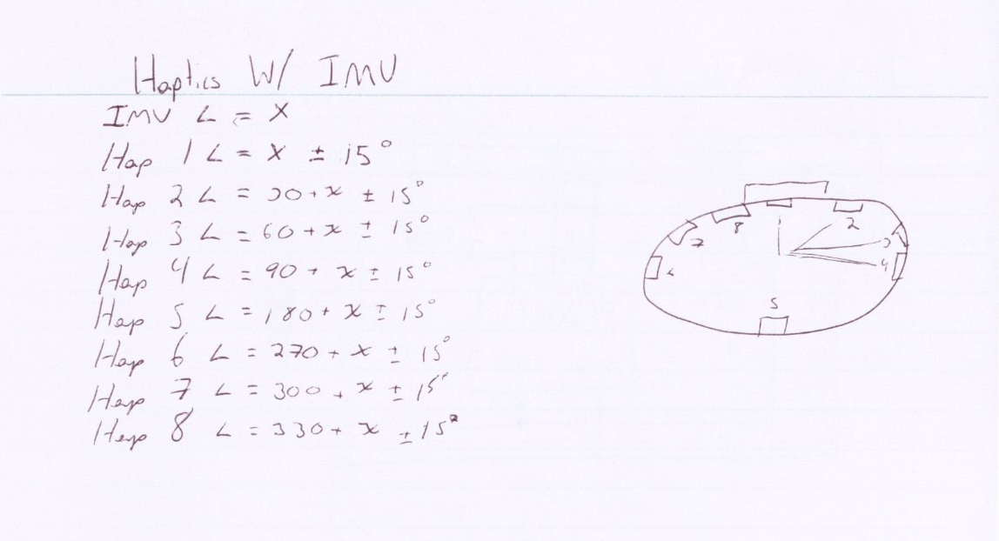
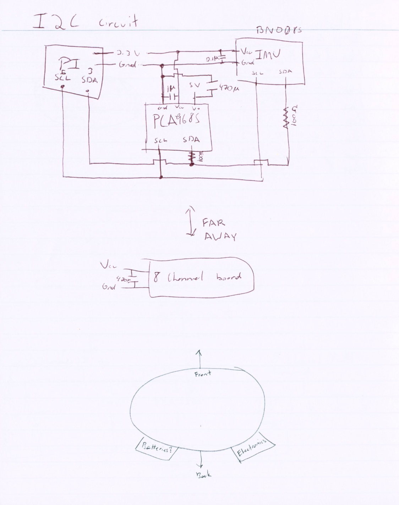
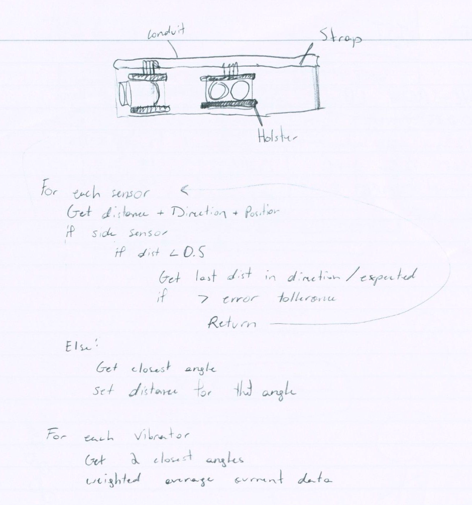

[Back to README](./README.md)

**Report leader for this week:** Jane Kim
**Bi-Weekly Progress Meeting:** 9/1/2026

# Sense360 - Biweekly Report 1

## 1. Provide an update on your progress according to your project plan; provide over/under of your progress vs. plan.

During this reporting period, the team revised the proposal, created and organized the project repository, completed preliminary system and belt sketches, selected the major components, and received the initial hardware. The current design uses a Raspberry Pi, HC-SR04 ultrasonic sensors, a BNO085 IMU, a PCA9685 PWM controller, MOSFET drivers, and vibration motors.

The first prototype will use four sensors and four vibration motors. Additional sensors and motors can be added after the initial design is tested. The project is currently on schedule, and the team is moving from planning into component testing and prototype construction.

## 2. Provide an update of teamwork: who is doing which tasks.

The team has handled the initial planning according to the roles below. More specific building and testing assignments will be distributed at the September 2 meeting.

| Team Member | Task | Status |
| :--- | :--- | :---: |
| Garrett | Create the team's repository and general organization | Complete |
| Bowen | Select, order, and prepare the hardware for the build | Complete |
| Jane | Maintain project documentation | In Progress |
| All members | Finalize the initial design | In Progress |
| All members | Meet with the parts and assign prototype-building jobs | Planned |

*Figure 1. Preliminary haptic motor and IMU direction mapping.*

*Figure 2. Preliminary I2C circuit and belt layout.*

*Figure 3. Preliminary belt mounting and software concept.*

## 3. If any new bottleneck/hurdle is discovered, please describe; also describe your solution to address the hurdle.

No major bottlenecks have been encountered because the materials were only recently received. The anticipated challenge is confirming that each component works separately and connecting the hardware to the Raspberry Pi. The team will test one subsystem at a time so that any wiring, communication, or power issue can be identified easily.

## 4. If you are behind schedule, please provide a plan to address.

N/A - The team is not behind schedule.

## 5. Describe your next step for the next two weeks.

The team will meet on September 2 to inspect the parts and assign the individual building, testing, and software responsibilities. Afterward, the team will test the sensors, IMU, PWM controller, MOSFET drivers, and vibration motors separately; connect the working subsystems to the Raspberry Pi one at a time; and begin assembling the four-sensor, four-motor prototype.
